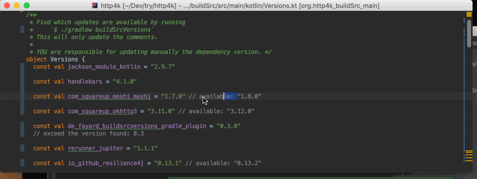

include::includes.adoc[]

//:imagesdir: /Users/jmfayard/Dev/mautinoa/buildSrcVersions/doc
:imagesdir: doc


= buildSrcVersions

{badge_version} {badge_build} {badge_mit} {badge_issues} {badge_pr}


[[img-libs]]
image::Libs.gif[title="IDE integration when you put your dependencies information in the buildSrc",alt="IDE Integration", width="600", link="{master}/doc/Libs.gif"]

Gradle has a special module called **buildSrc** where you can put Kotlin code and make it directly available to all your Gradle build files.

This is better than the traditional solution of putting your global variables in a Gradle `ext` property or in a Groovy `HashMap`,
because in that case, the IDE support is exactly what you would expect when you work with an `HashMap`.


Now, what is better than writing manually those files link:Versions.kt[`Versions.kt`] and link:Libs.kt[`Libs.kt`]?

Having a Gradle plugin write them for you maybe?

== Prerequisites

- Kotlin, JVM and Android projects.
- Gradle 4.3+ and Gradle 5.0+
- The IDE integration works in IntelliJ >= 2008.03+ and Android Studio 3.2+.
- The IDE integration  for both `build.gradle` (Groovy) and `build.gradle.kts` (Kotlin) files.


== Installation

Edit your root `build.gradle(.kts)` file

[source,kotlin,subs=attributes]
----
buildscript {
    //...
}
plugins {
  id("de.fayard.buildSrcVersions") version "{plugin_version}"
}
// Don't put any code before the buildscripts {} and plugins {} block
----

== Extract your dependencies

The plugin adds a task to your build, also called `:buildSrcVersions`. Run it like this:

```bash
$ ./gradlew buildSrcVersions
> Task :dependencyUpdates
> Task :buildSrcVersions
        new file:   buildSrc/build.gradle.kts
        new file:   buildSrc/.gitignore
        new file:   buildSrc/settings.gradle.kts
        new file:   buildSrc/src/main/kotlin/Libs.kt
        new file:   buildSrc/src/main/kotlin/Versions.kt
```

Synchronize your Gradle build and you can start to replace your magic strings:

```kotlin
dependencies {
    implementation(Libs.okio)
    implementation(Libs.com_squareup_moshi_moshi)
}
```


== Search for dependencies updates

[[img-versions]]


"Are you using the latest version?" is one of the most frequent questions when you open an issue.
Also most projects only document their latest release, for example because they mistake their README for their documentation.
Being able to stay up-to-date is also critically important, but it is also tedious.

This plugin inherits from https://github.com/ben-manes/gradle-versions-plugin[Ben Manes's Versions plugin]
the feature to automatically determine which dependencies have updates.

When you decide you want to update some dependencies, run again the plugin:

```bash
$ ./gradlew buildSrcVersions
> Task :dependencyUpdates
> Task :buildSrcVersions
        modified:   buildSrc/src/main/kotlin/Libs.kt
        modified:   buildSrc/src/main/kotlin/Versions.kt

```

The file `Versions.kt` is regenerated with a comment indicating which new version is available.

```kotlin
object Versions {
    const val moshi: String = "1.8.0"
    const val com_squareup_okhttp3: String = "3.11.0" // available: "3.12.0"
}
```

To update, Delete the part `"3.11.0" // available:&nbsp;` (including the non-breaking space!).

Remove the comment if you don't want to update.


== FAQ

TODO.


== Changelog

See {master}/CHANGELOG.md[CHANGELOG.md]

The project was called `gradle-kotlin-dsl-libs` before, which was a bad name for reasons explained in {issues}/26[#26]

== Contributing

- This project is licensed under the MIT License. See {master}/LICENSE.md[LICENSE.md]
- Explain your use case and start the discussion before your submit a pull-request
- Run the automated tests with `$ gw check`

Please read [CONTRIBUTING.md](https://gist.github.com/PurpleBooth/b24679402957c63ec426) for details on our code of conduct, and the process for submitting pull requests to us.


== Acknowledgments

https://gradle.org[Gradle] and https://jetbrains.com[JetBrains] have made this plugin possible
by working on improving the IDE support for Kotlin code from the `buildSrc` module.

This plugin embraces and extends https://github.com/ben-manes/gradle-versions-plugin[Ben Manes's wonderful "Versions" plugin].

The Kotlin code generation is powered by https://github.com/square/kotlinpoet[Square's Kotlinpoet]


