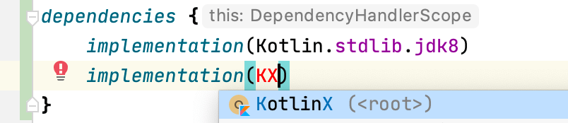
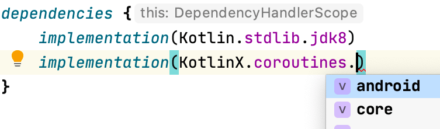
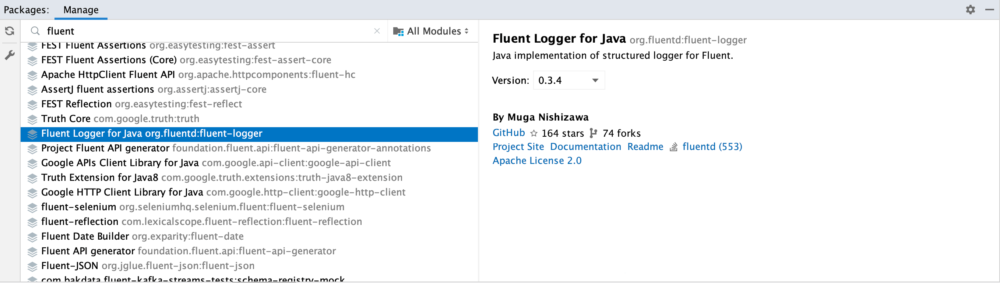

# Add dependencies

## Use built-in dependency notations

[**See Built-in Dependency Notations**](dependency-notations.md)

[](http://www.youtube.com/watch?v=VhYERonB8co "Gradle refreshVersions")


refreshVersions provides read-to-use organized dependency notations for select
popular libraries of the following ecosystems:

- Kotlin Multiplatform
- Kotlin/JVM
- Android

*That doesn’t prevent you from using refreshVersions in a Gradle project that is not using Kotlin or is not an Android project.*

You can use them in any `build.gradle` or `build.gradle.kts` file.

Here's an example of how it looks like in the IDE:

*No imports needed.*



*Autocomplete in IDE for easy discoverability.*




You can see [all the dependency objects in this directory]({{link.master}}/plugins/dependencies/src/main/kotlin/dependencies).

### Wait, what version are those dependencies using?

All these dependency notations specify their version as the version
placeholder (`_`), so refreshVersions can replace them seamlessly with the corresponding
value defined in the `versions.properties` file, via Gradle APIs.
The same will work for your own, non-built-in dependencies if you use that same version placeholder.

After adding a dependency that doesn't have its version specified in the
`versions.properties` file yet, refreshVersions will edit it and put the
most stable recent version in it on the next Gradle sync (or any other
Gradle run).

It will also put any less stable versions as comments, allowing you to
quickly upgrade if needed.

## Add Gradle plugins

This section doesn't apply to plugins that are configured in a
`buildscript` block (since these have their versions configured like
regular dependencies), but only to those that are configured solely with
a plugin id.

To add such a plugin, do as usual, but do not specify the version in the
`build.gradle` or `build.gradle.kts` file. Instead, set it up like so in
the `versions.properties` file:

=== "versions.properties"
```properties
plugin.com.apollographql.apollo=2.4.1

plugin.com.squareup.sqldelight=1.4.3
```

Then you can omit the plugin version in all `build.gradle(.kts)` of your project:

=== "some-module/build.gradle.kts"
```kotlin
plugins {
    id("com.squareup.sqldelight")
    id("com.apollographql.apollo")
}
```
=== "some-module/build.gradle"
```groovy
plugins {
    id 'com.squareup.sqldelight'
    id 'com.apollographql.apollo'
}
```

As you see, the convention is pretty simple. The key is the id of the plugin, prefixed by `plugin.`: `plugin.some.plugin.id` sets the version of the plugin of id `some.plugin.id`.

## Get the version from anywhere

In some cases, you might need to get the version defined in the `versions.properties` file in a Gradle script.
For these cases, there's the `versionFor` function that takes either a version key, or a full dependency notation.

Here's a usage example with Jetpack Compose in an Android project:

=== "build.gradle.kts"
    ```kotlin
    import de.fayard.refreshVersions.core.versionFor

    ...

    composeOptions {
        kotlinCompilerExtensionVersion = versionFor(AndroidX.compose.ui)
    }
    ```
=== "build.gradle"
    ```groovy
    import static de.fayard.refreshVersions.core.Versions.versionFor

    ...

    composeOptions {
        kotlinCompilerExtensionVersion = versionFor(AndroidX.compose.ui)
    }
    ```

Using `versionFor("version.androidx.compose.ui")` would also work, so long as `version.androidx.compose.ui` is defined in the `versions.properties` file.

## Non-built-in dependency notations

Generally speaking, so long as you have the version placeholder (`_`) in place of the version,
refreshVersions will handle it.

Below are some ways to deal with the dependency notations that are not built-in.

### Using buildSrcLibs

The Gradle task `buildSrcLibs` can be used to automatically generate a `Libs.kt` file in the [buildSrc](https://docs.gradle.org/current/userguide/organizing_gradle_projects.html#sec:build_sources), that will contain all the dependency notations curently used in your build.

To use it, you need to enable it:

=== "settings.gradle.kts"
    ```kotlin
    plugins {
        // See https://jmfayard.github.io/refreshVersions
        id("de.fayard.refreshVersions") version "{{version.refreshVersions}}"
    }

    refreshVersions {
        enableBuildSrcLibs() // <-- Add this
    }
    ```
=== "settings.gradle"
    ```groovy
    plugins {
        // See https://jmfayard.github.io/refreshVersions
        id 'de.fayard.refreshVersions' version '{{version.refreshVersions}}'
    }

    refreshVersions {
        enableBuildSrcLibs() // <-- Add this
    }
    ```

Then you can use the command `./gradlew buildSrcLibs` to generate accessors for your dependencies

```bash
$ ./gradlew buildSrcLibs
> Task :buildSrcLibs
        new file:   buildSrc/build.gradle.kts
        new file:   buildSrc/src/main/kotlin/Libs.kt
```

The generated file will look like this:

=== "buildSrc/src/main/kotlin/Libs.kt"
```kotlin
/**
 * Generated by `$ ./gradlew buildSrcLibs`
 */
object Libs {

    const val guava: String = "com.google.guava:guava:_"

    const val guice: String = "com.google.inject:guice:_"

}
```

Because this file uses the version placeholder (`_`), it is compatible with refreshVersions!

Read more: [gradle buildSrcVersions]({{link.site}}/gradle-buildsrcversions).


### Using Package Search from JetBrains

JetBrains offers the plugin [**Package Search**](https://plugins.jetbrains.com/plugin/12507-package-search),
it is compatible with both IntelliJ IDEA and Android Studio. It also has a website

Package Search provides a nice UX to add a dependency:



Can you use it with refreshVersions?

Sure, just use the version placeholder (`_`).

### Using Gradle 7+ Versions Catalogs

Gradle 7 comes with its own feature for centralizing dependencies: [Versions Catalogs](https://docs.gradle.org/7.0-rc-1/userguide/platforms.html#sub:central-declaration-of-dependencies).

With Versions Catalog, you have a file like `gradle/libs.versions.toml` where you can centralize all your dependencies and benefit from typesafe accessors in your `build.gradle[.kts]` file.

Since the feature is incubating, you need to enable it explicitly in the project's `settings.gradle[.kts]` file:
> `enableFeaturePreview("VERSION_CATALOGS")`

Does that work well with refreshVersions? Yes, as long as you use the version placeholder (`_`).

=== "gradle/libs.versions.toml"
```
[libraries]
accompanist-coil =  "com.google.accompanist:accompanist-coil:_"
accompanist-flowlayout = "com.google.accompanist:accompanist-flowlayout:_"
accompanist-insets = "com.google.accompanist:accompanist-insets:_"
...
```

In this configuration, the versions catalog centralizes the dependency notations, while refreshVersions takes care of setting and updating the versions.

We have ideas to integrate Versions Catalogs deeper into refreshVersions, see [this issue](https://github.com/jmfayard/refreshVersions/issues/333).

### Using the libraries.gradle pattern

An older approach to centralize dependencies is to have a `libraries.gradle` file:

=== "libraries.gradle"
```groovy
ext.libraries = [ // Groovy map literal
    spring_core: "org.springframework:spring-core:3.1",
    junit: "junit:junit:4.10"
]
```

=== "some-module/build.gradle"
```groovy
apply(from = "../libraries.gradle")

dependencies {
    compile libraries.spring_core
    testCompile libraries.junit
}
```

Does that work with refreshVersions too? Yes, just use the version placeholder (`_`):

=== "libraries.gradle"
```diff
ext.libraries = [ // Groovy map literal
-    spring_core: "org.springframework:spring-core:3.1",
+    spring_core: "org.springframework:spring-core:_",
-    junit: "junit:junit:4.10"
+    junit: "junit:junit:_"
]
```
