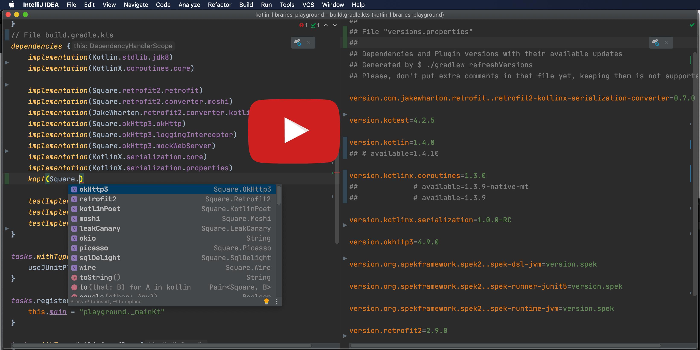

# Add dependencies

## Use built-in dependency notations

[](http://www.youtube.com/watch?v=VhYERonB8co "Gradle refreshVersions")


refreshVersions provides read-to-use organized dependency notations for select
popular libraries of the following ecosystems:

- Kotlin Multiplatform
- Kotlin/JVM
- Android

*That doesn’t prevent you from using refreshVersions in a Gradle project that is not using Kotlin or is not an Android project.*

You can use them in any `build.gradle` or `build.gradle.kts` file.

Here's an example of how it looks like in the IDE:

*No imports needed.*


*Autocomplete in IDE for easy discoverability.*


You can see [all the dependency objects in this directory]({{link.master}}/plugins/dependencies/src/main/kotlin/dependencies).

### Wait, what version are those dependencies using?

All these dependency notations specify their version as the version
placeholder (`_`), so refreshVersions can replace them seamlessly with the corresponding
value defined in the `versions.properties` file, via Gradle APIs.

After adding a dependency that doesn't have its version specified in the
`versions.properties` file yet, refreshVersions will edit it and put the
most stable recent version in it on the next Gradle sync (or any other
Gradle run).

It will also put any less stable versions as comments, allowing you to
quickly upgrade if needed.

## Add Gradle plugins

This section doesn't apply to plugins that are configured in a
`buildscript` block (since these have their versions configured like
regular dependencies), but only to those that are configured solely with
a plugin id.

To add such a plugin, do as usual, but do not specify the version in the
`build.gradle` or `build.gradle.kts` file. Instead, set it up like so in
the `versions.properties` file:

=== "versions.properties"
```properties
plugin.com.apollographql.apollo=2.4.1

plugin.com.squareup.sqldelight=1.4.3
```

Then you can omit the plugin version in all `build.gradle(.kts)` of your project:

=== "some-module/build.gradle.kts"
```kotlin
plugins {
    id("com.squareup.sqldelight")
    id("com.apollographql.apollo")
}
```
=== "some-module/build.gradle"
```groovy
plugins {
    id 'com.squareup.sqldelight'
    id 'com.apollographql.apollo'
}
```

As you see, the convention is pretty simple. The key is the id of the plugin, prefixed by `plugin.`: `plugin.some.plugin.id` sets the version of the plugin of id `some.plugin.id`.

## Other way to add dependencies

The built-in dependencies are there for convenience, but the plugin `refreshVersions` doesn't really care how you add dependencies to the build

As long as you use placeholder version `_`, your library is managed by gradle refreshVersions!

### Use gradle buildSrcVersions (WIP)

Yet another approach to managing dependencies is to use the **Gradle buildSrc** module, and to automatically generate a file `Libs.kt` that contains all the dependencies applied to your build:

=== "buildSrc/src/main/kotlin/Libs.kt"
```kotlin
/**
 * Generated by `$ ./gradlew buildSrcVersions`
 */
object Libs {

    const val guava: String = "com.google.guava:guava:_"

    const val guice: String = "com.google.inject:guice:_"

}
```

Now here is a good news: you don't need to write this file manually, it can be automatically generated!

This is done with [==> **gradle buildSrcLibs** <==](/gradle-buildsrcversions)


### Use Package Search from JetBrains

JetBrains offers the plugin [**Package Search**](https://plugins.jetbrains.com/plugin/12507-package-search).

Package Search provides a nice UX to add a dependency:


Can you use it with refreshVersions?

Sure, just use the version placeholder (`_`).

### Use the libraries.gradle pattern

An older approach to centralize dependencies is to have a `libraries.gradle` file:

=== "libraries.gradle"
```groovy
ext.libraries = [ // Groovy map literal
    spring_core: "org.springframework:spring-core:3.1",
    junit: "junit:junit:4.10"
]
```

=== "some-module/build.gradle"
```groovy
apply(from = "../libraries.gradle")

dependencies {
    compile libraries.spring_core
    testCompile libraries.junit
}
```

Does that work with refreshVersions too? Yes, just use the version placeholder (`_`):

=== "libraries.gradle"
```diff
ext.libraries = [ // Groovy map literal
-    spring_core: "org.springframework:spring-core:3.1",
+    spring_core: "org.springframework:spring-core:_",
-    junit: "junit:junit:4.10"
+    junit: "junit:junit:_"
]
```
