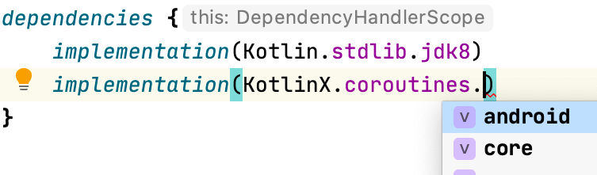

## Adding dependencies

### Built-in dependencies constants

[](http://www.youtube.com/watch?v=VhYERonB8co "Gradle refreshVersions")


refreshVersions provides read-to-use organized constants for select
popular dependencies of the following ecosystems:

- Kotlin Multiplatform
- Kotlin/JVM
- Android

*That doesn’t prevent you from using refreshVersions in a Gradle project that is not using Kotlin or is not an Android project.*

You can use them in any `build.gradle` or `build.gradle.kts` file.

Here's an example of how it looks like in the IDE:

*No imports needed.*


*Autocomplete in IDE for easy discoverability.*




You can see [all the dependency objects in this directory](https://github.com/jmfayard/refreshVersions/tree/master/plugins/dependencies/src/main/kotlin/dependencies).

All these dependency constants specify their version as the version
placeholder (`_`), so refreshVersions can replace it seamlessly with the
value defined in the `versions.properties` file.

After adding a dependency that doesn't have its version specified in the
`versions.properties` file yet, refreshVersions will edit it and put the
most stable recent version in it on the next Gradle sync (or any other
Gradle run).

It will also put any less stable versions as comments, allowing you to
quickly upgrade if needed.

### Adding Gradle plugins

This section doesn't apply to plugins that are configured in a
`buildscript` block (since these have their versions configured like
regular dependencies), but only to those that are configured solely with
a plugin id.

To add such a plugin, do as usual, but do not specify the version in the
`build.gradle` or `build.gradle.kts` file. Instead, set it up like so in
the `versions.properties` file:

```properties
# versions.properties

plugin.com.apollographql.apollo=2.4.1

plugin.com.squareup.sqldelight=1.4.3
```

Then you can omit the plugin version in all `build.gradle(.kts)` of your project

```kotlin
// SOME_MODULE/build.gradle(.kts)
plugins {
    id("com.squareup.sqldelight")
    id("com.apollographql.apollo")
}
```

As you see, the convention is pretty simple. The key `plugin.some.plugin.id` sets the version of the plugin `id("some.plugin.id")´.


