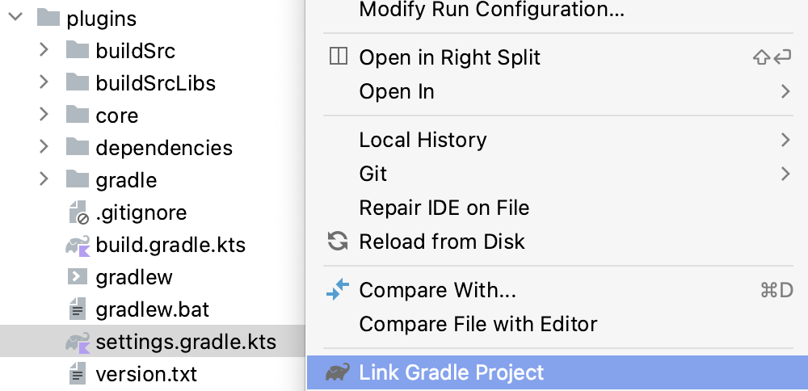

# Dev environment for contributors

### Setting up the project in your IDE

#### Get the right IDE

We recommend using the most recent version of IntelliJ IDEA to contribute to this project (consider 2020.3 or newer).

#### Prepare your fork

1. Fork this project from GitHub if not already done.
2. Clone your fork locally.
3. Checkout the `main` branch.
4. If your fork is not fresh, ensure its `main` branch is up to date with upstream:
    1. Run the `git fetch upstream` command.
    2. Run the `git merge upstream/main` command.
5. Create a new branch based on `main` with a name describing what it is about.

#### Import the "plugins" Gradle project

1. Locate the `plugins/settings.gradle.kts` file in the "Project" tool window.
2. Right-click on it to open the contextual menu.
3. Select "Link Gradle Project".



#### Publish the current version locally

This step is required for the samples to work afterwards and enable you to test your changes.

1. Ensure the version in the `plugins/version.txt` file ends with `-SNAPSHOT` to avoid overlapping a published version.
2. In the "Gradle" tool window, or from the terminal, run the `publishToMavenLocal` task.

### Testing changes locally

#### Import the samples to test the changes

We have multiple samples to test integration in different scenarios.

Here are their names, you can find them in so-named directories in the repo:

1. sample-kotlin
2. sample-groovy
3. sample-android
4. sample-multi-modules

The first two samples (sample-kotlin and sample-groovy) are the ones you should always test your changes on. They are lightweight, so it's quick to set up and iterate with.

For edge cases in multi-modules projects and for Android specific things, the two other samples are the ones to test your changes on.

To import a sample, just like you did for the `plugins` Gradle project, right-click on the `settings.gradle` or `settings.gradle.kts` file and select the "Link Gradle Project" option.

#### Testing in your own project

To test your changes in your own project locally, in the `settings.gradle` or `settings.gradle.kts` file, you need to add the `mavenLocal()` repository in the `pluginManagement` section (create the block at the top of the file if you don't already have one):

```kotlin
pluginManagement {
    repositories {
        gradlePluginPortal() // Needed to keep using the Gradle plugin portal for other plugins.
        mavenLocal() // Also use mavenLocal for local-only versions.
    }
}
```

Once you're done, you can replace the version with the snapshot version (e.g. `0.9.8` -> `0.9.9-SNAPSHOT`) and test your changes.
