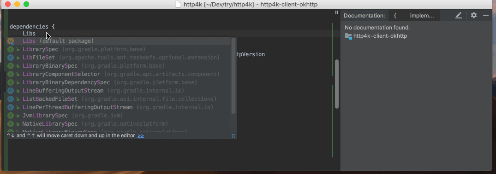

## The buildSrc module

The `buildSrc` is a Gradle module where you can write Kotlin code (with full tooling support).
That code is then be available to all your build files - not your final application.

One cool thing you can do with it is to replace those [libraries.gradle files](https://github.com/abbas-oveissi/SearchMovies/blob/607ce1c6f9aa48669ab1b91f8824e9251f2a1fa5/libraries.gradle) we used to write:

=== "buildSrc/src/main/kotlin/Libs.kt"
```kotlin
object Libs {
    const val okhttp = "com.squareup.okhttp3:okhttp:" + Versions.okhttp
    const val okio = "com.squareup.okio:okio:" + Versions.okio
}
```

=== "buildSrc/src/main/kotlin/Versions.kt"
```kotlin
object Versions {
    const val okhttp = "3.12.1"
    const val okio = "2.0.0"
}
```

The crucial difference was that IntelliJ IDEA and Android Studio have good support for calling it from `build.gradle[.kts]`

Finally the IDE tooling we deserve:

- auto-completion
- jumping to definition
- ...


## "gradle buildSrcVersions" is dead…

The ancestor of the *plugin* `refreshVersions` was a *plugin* called `buildSrcVersions`.

What it did was to auto-generate the `buildSrc/.../{Libs,Versions}.kt` files above!

```bash
$ ./gradlew buildSrcVersions
> Task :buildSrcVersions
        new file:   buildSrc/build.gradle.kts
        new file:   buildSrc/.gitignore
        new file:   buildSrc/src/main/kotlin/Libs.kt
        new file:   buildSrc/src/main/kotlin/Versions.kt
```

## …long life "gradle buildSrcLibs"!

The `Versions.kt` file was replaced by a technically better solution, the `versions.properties` file.

That said, the `Libs.kt` file still has its use cases, so in your `settings.gradle(.kts)` file,
you can add the following:

```groovy
refreshVersions {
    enableBuildSrcLibs()
}
```

That will enable the task `buildSrcLibs`, which also has an alias: `buildSrcVersions` for easier transition for existing users.

Use it like this:

```bash
$ ./gradlew buildSrcLibs
> Task :buildSrcLibs
        new file:   versions.properties
        new file:   buildSrc/src/main/kotlin/Libs.kt
```

The task generates what you expect:

=== "versions.properties"
```properties
version.okhttp=3.12.1
version.okio=2.0.0
```

=== "buildSrc/src/main/kotlin/Libs.kt"
```kotlin
object Libs {
    const val okhttp = "com.squareup.okhttp3:okhttp:_"
    const val okio = "com.squareup.okio:okio:_"
}
```

The constants generated in `Libs.kt` have the same name as they had in the `buildSrcVersions` *plugin*.

This makes updating to refreshVersions pretty straightforward.

## Replace your dependencies

First, reload/sync your Gradle project in the IDE.

You can now start to replace your magic strings with the properties available in `Libs.kt`



## Update dependencies

You can still automatically look for updates, but this is now done with the task `refreshVersions` and editing the file `versions.properties`

```bash
$ ./gradlew refreshVersions
```

Read more: [**Update dependencies**](update-dependencies.md).
