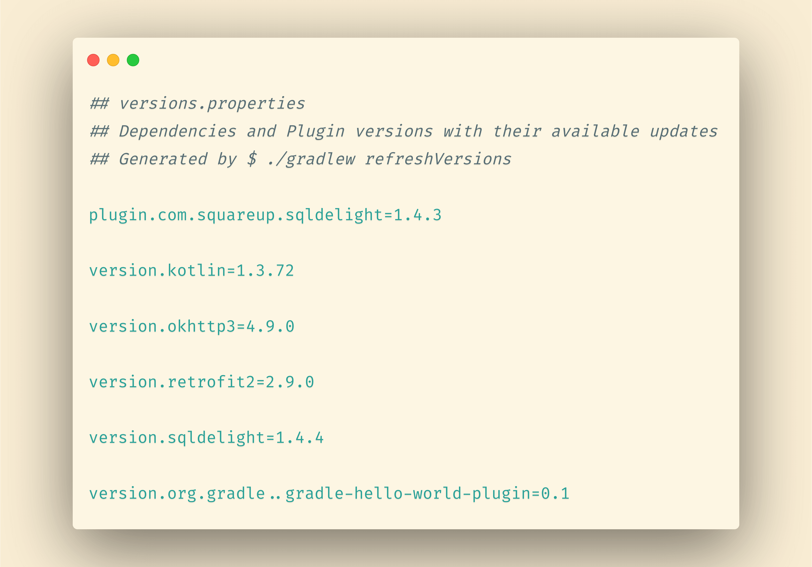

# Gradle refreshVersions

> Life is too short to google for dependencies and versions

## Why refreshVersions?

Gradle multi-module projects are on the rise.

At the same time, library vendors publish very modularized artifacts:

* On Android, the big fat support libraries are dead, and their replacement, `AndroidX`,
contains more than 200 different dependencies, grouped in over 70 groups, each having its own version. (AndroidX is only a part of first-party dependencies for Android projects, and third party dependencies can add up.)
* On the server, many frameworks or library suites offer a high number of artifacts. That applies to Ktor, Spring, http4k and others. Again, that's not even counting third party dependencies.

Both trends come with great technical benefits.

However, they also make it much more tedious to find where to add and update your dependencies in all those `build.gradle[.kts]` files!

_We saw this make developers update the dependencies less and less often, effectively leading to legacy accumulation (a form of technical debt), or even projects abandon. Yes, that's sad._

_**Can we have our cake and eat it?**_

We firmly believe that yes, **we can have the benefits of modularization without the hell of dependency management**.

So what does `gradle refreshVersions`?

## Centralize your dependencies in a proper file format

Everyone who uses Gradle in a multi-modules environment
has looked for a way to centralize all dependencies in one place.
And there are solutions for that.
Too many solutions in fact.
Some put their versions in a variable `val retrofitVersion = 2.9.0`, others in `rootproject.ext`,
others in a `libraries.gradle` file, others still in `buildSrc/src/main/Versions.kt`,
and the list goes on and on!

A problem common to all those solutions is that they store the versions
**in a turing-complete programming language** (Groovy or Kotlin).
Then people try to hack together regular expressions to read or modify those files.

We think this is wrong!

Instead, **gradle refreshVersions** stores all the versions in one place in a proper file format:
Java Properties, like [`gradle.properties`](https://dev.to/jmfayard/configuring-gradle-with-gradle-properties-211k).
Just like npm's *package.json*, Maven's *pom.xml*, this file can be easily read and written by a computer program.
Yes to better tooling!

## No Magic!

You wonder how this works?

No black magic involved, we leverage Gradle public APIs that are designed to edit declared dependencies (`Configuration.withDependencies`, and `PluginManagement.resolutionStrategy`), and we edit the versions constraints there.
The rest is just a set of conventions.

Consider the example below:

| Dependency notation                           | Version key                                   |
|-----------------------------------------------|-----------------------------------------------|
| org.gradle:gradle-hello-world-plugin:_        | version.org.gradle..gradle-hello-world-plugin |
| com.squareup.retrofit2:retrofit:_             | version.retrofit                              |
| com.squareup.retrofit2:retrofit-adapter-xxx:_ | version.retrofit                              |
| plugin with id "com.squareup.sqldelight"      | plugin.com.squareup.sqldelight                |

- gradle refreshVersions works with **an opt-in mechanism.** It only manages dependencies where the version is set to be a placeholder, more specifically the underscore `_`, which, akin to Kotlin, here means that the version is not used, being instead set in the `versions.properties` file.
- gradle refreshVersions has a system of **[rules]({{link.master}}/plugins/dependencies/src/main/resources/refreshVersions-rules)** that here, allows to set all Retrofit dependencies with the same version key `version.retrofit` , keeping things DRY.

## Look up for updates automatically

With this infrastructure being in place, the major feature of **gradle refreshVersions** is like its name suggests: **It will look up for all available updates of the dependencies used in the project.**

Simply run `$ ./gradlew refreshVersions` and you will see the available updates **as comments**:

Why as comment? Because while googling manually for available updates is a monkey job that is best done by a computer program, while **deciding whether to upgrade or not is your job** as a programmer.

Read more: [Update Dependencies](update-dependencies.md)

## It's fast!

The [Kotlin Libraries Playground]({{link.playground}}) contains about 80 dependencies, and counting.

How long would it take to search for all available updates?

- Well, if you do it manually: *enough to hate your life*.
- With the [gradle-versions-plugin](https://github.com/ben-manes/gradle-versions-plugin) it will take about 2 minutes.
- With refreshVersions, you are done in **10 seconds**!

[See benchmarks here.]({{link.playground}}/pull/69)

## Add dependencies quickly!

gradle refreshVersions provides ready-to-use organized dependency notations for popular libraries.

Read more: [Add Dependencies](https://jmfayard.github.io/refreshVersions/add-dependencies/)

## Requirements

- Gradle 6.8+
- IntelliJ IDEA or Android Studio

## Try it out with zero setup!

The simplest way to try out gradle refreshVersions is with our official sample,
the [**Kotlin libraries Playground**]({{link.playground}})!

Everything is pre-configured here, so just open the project in IntelliJ and start adding and upgrading dependencies.

*Warning: You may also learn a ton of things about Kotlin libraries in the process!*

## Funding ❤️

We hope this open source project saves you a lot of time!

It is maintained by its authors, Jean-Michel Fayard and Louis CAD.

You can **buy us more time** by becoming our sponsors:

- 💝 [Louis CAD GitHub Sponsors page](https://github.com/sponsors/LouisCAD)
- 💝 [Jean-Michel GitHub Sponsors page](https://github.com/sponsors/jmfayard)

We're very grateful to you and [our existing sponsors]({{link.master}}/SPONSORS.md), thank you! ❤️❤️

## Contributing

If you only want to submit an issue, see this [quick guide](contributing/submitting-issues.md) to maximize the likelihood of it being eventually resolved.

If you want to submit a successful PR, start by reading [our guide](contributing/before-you-contribute.md).

## License

This project is provided under the MIT License.
