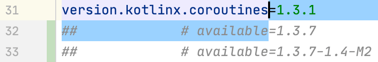

# Updating dependencies

The core feature is gradle refreshVersions is that it will lookup auto-magically for available updates for all the dependencies that it manages.

This is done in three small steps:

## 1. Run `$ gradle refreshVersions`

Run the `refreshVersions` gradle task on the root project:

`$ ./gradlew refreshVersions`

Hint: You don't need to leave the IDE to run a Gradle task. IntelliJ has an handy action `Execute Gradle Task`:

Gradle refreshVersions is fast: it usually takes less than 10 seconds to execute on relatively big projects.

## 2. Edit the `versions.properties` file

Open the `versions.properties` file

Let say you have this initial state:

After you run `$ ./gradle refreshVersions`, you will see the available updates **as comments**.

Why as comment? Because while googling manually for available updates is a monkey job that is best done by a computer program, *deciding whether to upgrade or not* is *your* job as a programmer.

If you decide to update, just replace the previous version with the update*

If you decide to **not** update, just delete the comments, they should be commited to your repository.

## 3. Sync Gradle

The file `versions.properties` is part of the Gradle build.

So after you have edited it, run the action `Sync Project with Gradle Files`

At that point, you probably want to:

- run your unit tests
- do some mock tests with your app
- commit when you are happy.
