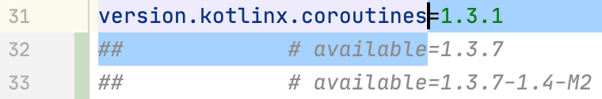

# Usage

## Adding dependencies

### Built-in dependencies constants

[](http://www.youtube.com/watch?v=VhYERonB8co "Gradle refreshVersions")


refreshVersions provides read-to-use organized constants for select
popular dependencies of the following ecosystems:

- Kotlin Multiplatform
- Kotlin/JVM
- Android

*That doesn’t prevent you from using refreshVersions in a Gradle project that is not using Kotlin or is not an Android project.*

You can use them in any `build.gradle` or `build.gradle.kts` file.

Here's an example of how it looks like in the IDE:

*No imports needed.*


*Autocomplete in IDE for easy discoverability.*


You can see [all the dependency objects in this directory](https://github.com/jmfayard/refreshVersions/tree/master/plugins/dependencies/src/main/kotlin/dependencies).

All these dependency constants specify their version as the version
placeholder (`_`), so refreshVersions can replace it seamlessly with the
value defined in the `versions.properties` file.

After adding a dependency that doesn't have its version specified in the
`versions.properties` file yet, refreshVersions will edit it and put the
most stable recent version in it on the next Gradle sync (or any other
Gradle run).

It will also put any less stable versions as comments, allowing you to
quickly upgrade if needed.

### Adding Gradle plugins

This section doesn't apply to plugins that are configured in a
`buildscript` block (since these have their versions configured like
regular dependencies), but only to those that are configured solely with
a plugin id.

To add such a plugin, do as usual, but do not specify the version in the
`build.gradle` or `build.gradle.kts` file. Instead, set it up like so in
the `versions.properties` file:

```properties
# versions.properties

plugin.com.apollographql.apollo=2.4.1

plugin.com.squareup.sqldelight=1.4.3
```

Then you can omit the plugin version in all `build.gradle(.kts)` of your project

```kotlin
// SOME_MODULE/build.gradle(.kts)
plugins {
    id("com.squareup.sqldelight")
    id("com.apollographql.apollo")
}
```

As you see, the convention is pretty simple. The key `plugin.some.plugin.id` sets the version of the plugin `id("some.plugin.id")´.


### Other dependencies

For dependencies that are not included in the provided constants, all
you need to have them work with refreshVersions is to replace the
version with the version placeholder (`_`),

After adding a dependency that doesn't have its version specified in the
`versions.properties` file yet, refreshVersions will edit it and put the
most stable recent version in it on the next Gradle sync (or any other
Gradle run).

It will also put any less stable versions as comments, allowing you to
quickly upgrade if needed.

## Updating the dependencies

Day-to-day usage of `refreshVersions` is done in two steps.

First, you discover the available updates. Second, you apply the updates
you want.

(scroll down to see an example below)

## Find available updates (aka. refreshVersions)

Run the `refreshVersions` gradle task on the root project:

`./gradlew refreshVersions`

*(It usually takes less than 10 seconds to execute on relatively big
projects.)*

Open the `versions.properties` file and see the available updates added
as comments.

### Apply updates

Applying updates can be done in the `versions.properties` file with just
the keyboard:

1.  Put the caret before or after the `=` symbol on the available update
    line.
2.  While holding shift (for text selection), press the up arrow key
    until the version key.
3.  Press the backspace/delete key.
4.  If you're in an IDE, sync Gradle changes to see the updated
    dependencies.

Note that checking for compatibility, regressions, and performing any
required changes or migrations cannot be done by refreshVersions. This
is your responsibility (shared with your tests and QA).

### Example

Because images speak better than thousands of words, here's an example
with screenshots.

*Note: kotlinx.coroutines latest releases at the time of that example
are `1.3.7` and `1.3.7-1.4-M2`.*

*Step 0: Initially used version*


*Step 1: Run the `refreshVersions` task to find updates*


*Step 2: Replace the previous version with the update*



*Tip: You can upgrade easily with just the keyboard. To so do, place the
caret next to the equals sign (`=`) of the version you want to use, hold
shift and press the up arrow key, and press the delete key to complete
the upgrade.*

*Final step: Usual post-upgrade actions (check, migrate, commit, push, CI...)*


